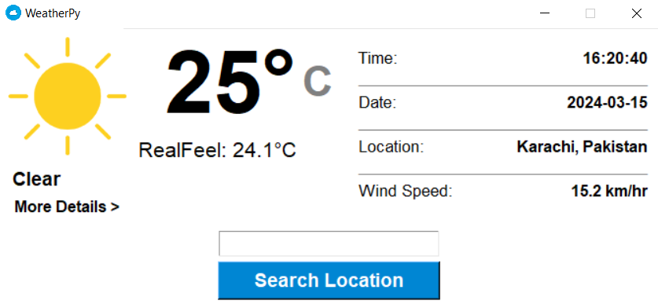
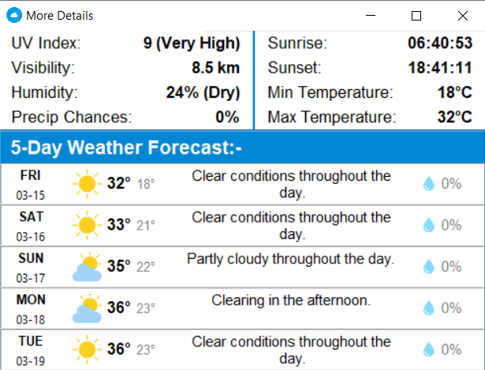
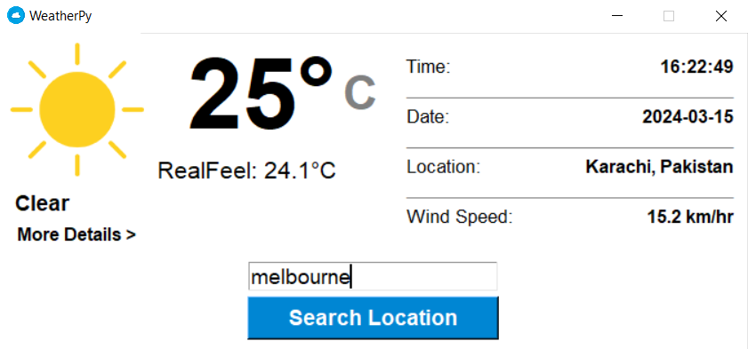
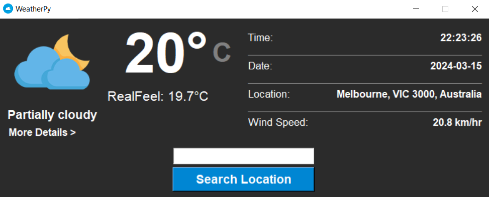
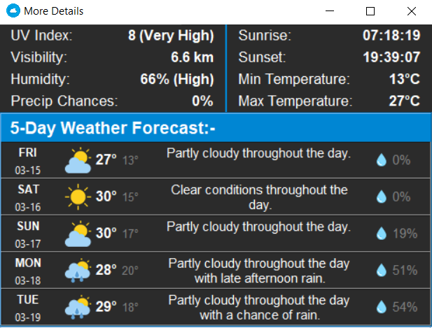

# WeatherPy
Simple Weather Application made using Tkinter and connected with API's using Requests Module.

## Installation For Source Code
1. Clone This Repository to your machine
2. Create a Python virtual environment (optional but recommended) using Command Prompt in the Repository   Folder:
```python -m venv venv```
3. Install the required Python packages using Command Prompt:
```pip install -r requirements.txt```
4. Done!

## Just Want to Play around with the Software?
Download weatherpy.rar in the build folder, extract it and launch weatherapp.exe!

## Screenshot of the Software:-




